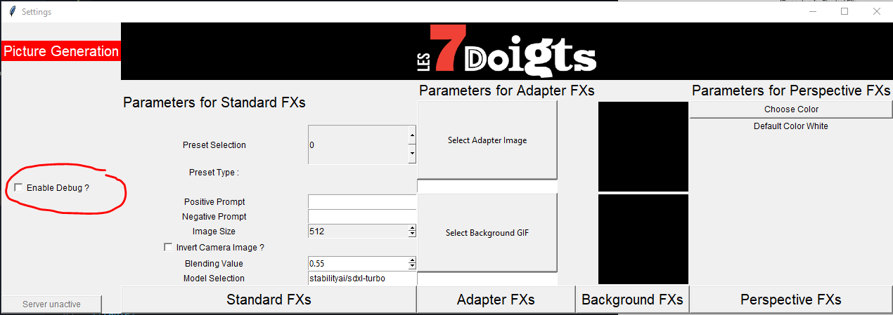
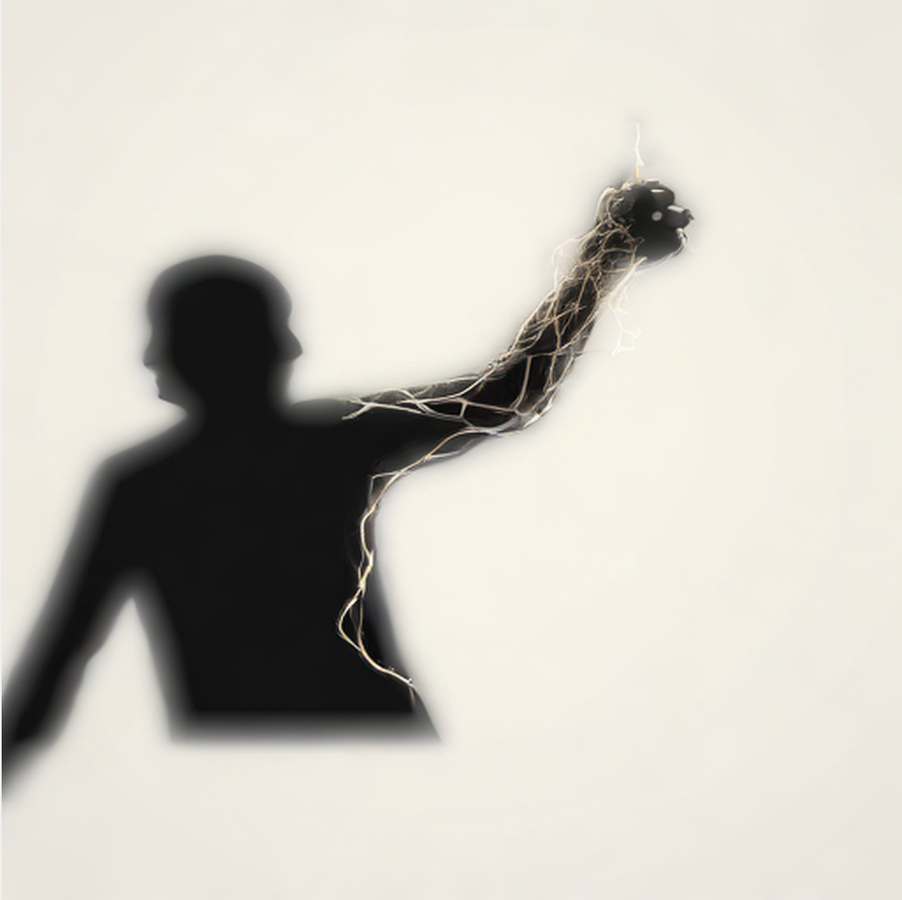

# 7Doigts-GenAI-RT 


## I - Introduction

This project is designed for the [7 Doigts](https://7doigts.com/) / [7 Fingers](https://7fingers.com/) company.
It contains the code for generating live pictures using Stable Diffusion based on a camera input.

## II - Installation

### 1. Download

Clone this repository using `git clone https://github.com/Batiste32/7Doigts-GenAI-RT/`.

### 2. (Recommended) Creating a VENV

Creating a virtual environment (venv) is recommended in order to preserve your other installations.
This will allow you to have a separate Python installation with the correct packages.
This project was built for **Python 3.11**.

```bash
cd 7Doigts-GenAI-RT
python -m venv .venv
cd .venv/Scripts
activate
cd ../..
```

### 3. Installing the libraries

This project was built for **Python 3.11** using **CUDA 1.12**.

```bash
python -m pip install -r requirements.txt
```

Then install the correct torch installation. If you use a different CUDA (check it in `Programs/NVIDIA GPU Computing Toolkit`), please refer to [Torch official site](https://pytorch.org/get-started/locally/) to get the correct version.

```bash
python -m pip install torch torchvision torchaudio --index-url https://download.pytorch.org/whl/cu121
```

## III - Using the project

### External setup

To make this project work, you will need a camera connected to your computer and **available**
(ie. not being used by another software).

```bash
python main.py
```

An input field should appear, asking for a model path. This is where the models will be (down)loaded. It should only ask this once as this path will be set as a system environment variable. Current path will also be written in the config file. To make sure it has taken effect, you should restart the program.

Afterward, a message will be displayed in the terminal asking wehter or not the output should be broadcast to a server : 

```
Should the output be broadcast to the server ? Y/N   ->
```

**Warning :** Using the server might degrade performances or slow the program down.

### Main Interface

A first Tkinter interface should open up with a selection of parameters.
Some presets have been defined and can be accessed by using the spinbox on the left.

<p align="center">
    
</p>

### Generation Interface

A second interface should be created displaying the results.
If the debug mode is left unchecked, only the output will be shown, in fullscreen.

<table align="center">
<tr>
<td></td>
<td></td>
</tr>
</table>

If the debug mode is activated, the input will be shown with the output.

<p align="center">
    
</p>

Note : For this example, I use a Kinect camera with a body tracking algorithm, which gives this black and white input, ideal for abstract transformation. If you use a standard webcam, it might be preferable to use more "realistic" prompts.

### The different effects

At the bottom of the main interface, there is a collection of buttons to start the different generation styles :

<p align="center">
    
</p>

Each of them requires different input fields. To explore each possibility, it is recommended to use the preset selection to see what kind of effect requires what inputs and what kind of output you can expect. If an input isn't defined, default values will be used.

**List of Inputs per effect :**

| Effect Type       | Positive Prompt | Negative Prompt           | Adapter Image        | Background GIF        | Blending Value |
|-------------------|------------------|---------------------------|-----------------------|-----------------------|-----------------|
| **Standard effect**    | ✓                | ✓                         |                       |                       | ✓               |
| **Adapter effect**     | ✓                | ✓                         | ✓                     |                       | ✓               |
| **Background effect**  | ✓                | ✓                         | ✓                     | ✓                     | ✓               |
| **Perspective effect** | ✓                | ✓                         | _(optional)_          |                       |                 |

### Visualising the effects by WiFi (Flask server)

You can use a Flask server to view your output in real time on any device by answering `Y` when booting the program.

You will then be able to connect to the server on the ip of the server, port `3142` and adding `/video_feed`
(ex : `123.456.789.0:3142/video_feed`)
Note : you will only be able to view the output, **not the input** enven in debug mode.

In the interface, 2 buttons will appear, related to the server :

<p align="center">
    
</p>

The first one will indicate the URL to enter to access the broadcast, clicking it will directly open the page in your browser.
The second one will kill the application and close the server correctly.
**This is the best way to close the app, otherwise you will have to kill the terminal / kernel.**